# Ripe: Empowering Secure and Anonymous Voting

Ripe is a tool designed to empower your organization with **seamless, anonymous, and secure voting on critical decisions.** Our platform leverages the Minimal Anti-Collusion Infrastructure (MACI) from the PSE Team to protect voter privacy and ensure tamper-proof results. All of this is wrapped in a user-friendly environment where discussions and proposals come to life.

## Workflow

As a user, you can **create** and **manage** multiple organizations, each with its own **discussions**. Within these discussions, you can invite participants **with authorized email domains** to vote on various proposals. The voting is conducted anonymously and securely using MACI, which safeguards both the integrity of the vote and the identity of the voter.

## The MVP

During the last 36 hours, we've developed the core voting workflow, providing the essential functionalities required for users to participate in anonymous voting processes. These features form the foundation of our application and pave the way for further enhancements.

While the features for creating organizations and initiating discussions are still under development, they are planned for **release in version 1.5**.

During development, we spent considerable time integrating the email feature, crucial for validating and managing voter registration. Despite encountering challenges with the ThirdWeb SDK, we managed to validate the coordinator's email domain, ensuring it originates from a **institution**.

One of the more challenging tasks was enabling the coordinator to register voters via email -while creating them a wallet in the backend. Although **we’ve made a lot of progress on this feature**, we plan to refine it and make it more robust for the next release in version 1.5.

Although we didn’t fully implement all features in this release, we have a clear roadmap for achieving this through the following pipeline:

- **User Login:** The user logs in with a thirdweb wallet, utilizing account abstraction to enable Google account login.
  
- **JWT Generation:** Once authenticated, a JSON Web Token (JWT) is generated, allowing us to verify the domain of the associated email address. This step certifies that the user belongs to a specific organization by reading the JWT payload.

- **Attestation:** After successful domain verification, the coordinator issues an attestation to the user, enabling them to vote. 

You can see the implementation of this at [Santi's Branch] (https://github.com/PattoPeraltta/Ripe/tree/santi)

After all, time is limited!

## Key Features

- **Organizations:** Create and manage organizations to handle discussions and voting.
- **Discussions:** Within each organization, create discussions where proposals are presented for voting.
- **Participant Invitations:** Invite participants with specific email domains to join discussions and vote.
- **Anonymous Voting:** Voting is conducted using MACI, ensuring that the process is both anonymous and secure.
- **Identity Verification:** We use JSON Web Signatures (JWS) through thirdweb to verify users' identities upon registration.
- 


```mermaid
graph LR
    subgraph User Interaction
        A[User] --> B[Identity Verification via thirdweb]
        B --> C[Account Creation]
    end

    subgraph Organization Management
        C --> D[Create and Manage Organizations]
        D --> E[Start Discussions]
        E --> F[Invite Participants with Specific Email Domains]
    end

    subgraph Voting Process
        F --> G[Vote on Proposals]
        G --> H[MACI for Anonymous Voting]
        H --> I[Protection of Vote Integrity and Voter Identity]
    end

    style A fill:#B6CDEC,stroke:#222133,stroke-width:2px,rx:15,ry:15,color:#222133
    style B fill:#B6CDEC,stroke:#222133,stroke-width:2px,rx:15,ry:15,color:#222133
    style C fill:#B6CDEC,stroke:#222133,stroke-width:2px,rx:15,ry:15,color:#222133
    style D fill:#B6CDEC,stroke:#222133,stroke-width:2px,rx:15,ry:15,color:#222133
    style E fill:#B6CDEC,stroke:#222133,stroke-width:2px,rx:15,ry:15,color:#222133
    style F fill:#B6CDEC,stroke:#222133,stroke-width:2px,rx:15,ry:15,color:#222133
    style G fill:#B6CDEC,stroke:#222133,stroke-width:2px,rx:15,ry:15,color:#222133
    style H fill:#B6CDEC,stroke:#222133,stroke-width:2px,rx:15,ry:15,color:#222133
    style I fill:#B6CDEC,stroke:#222133,stroke-width:2px,rx:15,ry:15,color:#222133

```

## Technologies Used

- **Minimal Anti-Collusion Infrastructure (MACI):** MACI is the core protocol that secures the voting process.
  
- **Ethereum Attestation Service (EAS):** These attestations verify and validate actions within the ecosystem, ensuring the integrity and transparency of the voting process.
  
- **Account Abstraction via thirdweb:** We use thirdweb for account abstraction, simplifying wallet management and ensuring a seamless user experience. So even your Aunt Lilly can vote with her co-workers on where the budget goes!
  
- **Deployment on Scroll Sepolia:** The platform is deployed on Scroll Sepolia for scalability and performance.

## Team

<p align="center">
    <a href="https://x.com/santi_nihany">
        
    </a>
     <a href="https://x.com/luzalbaposse">
        
    </a>
    <a href="https://x.com/PatojPeralta">
        
    </a>
</p>

## Why Ripe is a Great Use of MACI

Ripe exemplifies the ideal use case for MACI by addressing critical challenges in secure, anonymous voting within organizations. Our platform aims to be fully integrated, from frontend to backend, and deployed on Scroll Sepolia, ensuring both functionality and accessibility.

### Solving a Significant Problem

By leveraging MACI, Ripe provides a robust solution that ensures votes remain anonymous and secure, addressing a significant need in both decentralized and traditional voting contexts, all while maintaining a user-friendly experience --which is the main obstacle when using this type of technology.

### Innovative Use of Technology

Ripe introduces a different approach to voting security with its **email domain verification feature**. This feature leverages **institutional affiliation** as a **gatekeeper** within the voting protocol, allowing organizations to restrict voting access to specific email domains. 

This novel integration of MACI with traditional organizational structures enhances the trustworthiness and relevance of the voting process, ensuring that the right stakeholders are involved in decision-making. **This approach could be expanded to serve as a broader gatekeeping tool, controlling access to sensitive voting and governance decisions based on institutional affiliation or other criteria inside MACI.**

## Contranct Addresses Deployed on Scroll Sepolia

- `ConstantInitialVoiceCreditProxy:` 0xC413538578345f60Db652Cd386622Bc80bDb929B
  Link to Scroll Sepolia: https://sepolia.scrollscan.dev/address/0xC413538578345f60Db652Cd386622Bc80bDb929B
- `EASGatekeeper:` 0x858666eB9c78F8846Cab53e784867D9087f001ca
- `Verifier:` 0x6632586B141265CE7dd56e652a420B4288Da9aC3
- `TopupCredit:` 0x91a9CAC596B52e7AfA86087cdB195C0e3A01d8bb
- `PoseidonT3:` 0xC03E6A9d17cA60244Ae2bE08De3F8d6FcafdE04E
- `PoseidonT4:` 0xd955d2437337134224Bc4EbC9016EBb8D5995156
- `PoseidonT5:` 0x790bfA011aB2eD3dF96B8f6177D65fEA4C1D8F25
- `PoseidonT6:` 0x5EC80820A774280Bdf21f471D373FC89C9A88C78
- `PollFactory:` 0x1D6a5597303fff2B50300521dcc87ab347fcA0AF
- `MessageProcessorFactory:` 0x402767Ba2C09729EE2b512ec114eE925cDc7DE71
- `TallyFactory:` 0x4a77BC9C502920588cFD94f56a643732700907F4
- `MACI:` 0xf64B3fB7619f7855A4457c3bfbEEf663cA50aa7f
- `AccQueueQuinaryBlankSl:` 0x0fa43A0Cb85698F8D7Da5A784CF67FcD054E0B1F
- `VkRegistry:` 0xDcc99dc6E24E6A1Bf4D3BFb8cfa189A83B54D65f
- `Poll-poll-0:` 0xb7C0748cc64E59C3cdB2dDd2E046D04E17c49A36
- `MessageProcessor-poll-0: `0x89CB9Cfe54BE6bC423F219898014E98F11BFEc2d
- `Tally-poll-0:` 0x961C767eF2032F156A54185400193360C78E5DeF
- `AccQueueQuinaryMaci-poll-0:` 0x68d0C93a7b78bBd1CDc66bF4896Ac98780Bbe14f

## Installation

1. Clone this repo using `git clone https://github.com/PattoPeraltta/Ripe`
2. Install MACI
```bash
git clone https://github.com/privacy-scaling-explorations/maci.git && \
cd maci && \
git checkout v1.2.4 && \
pnpm i && \
pnpm run build
```
3. Download .zkey files
```
pnpm download:test-zkeys
```
4. Set `.env`
```
MNEMONIC="your_ethereum_secret_key"
ETH_PROVIDER="the_eth_provider_url"
ETHERSCAN_API_KEY="etherscan api key"
```
5. Generate MACI Keys
```
cd cli && \
node build/ts/index.js genMaciKeyPair
```

6. Deploy MACI Contracts

Run `pnpm deploy` to deploy the contracts 

```bash
pnpm deploy:scroll-sepolia
```

7. App run
   ```bash
   pnpm install
   pnpm dev
   ```
   
## Credits 

We built our project on the foundation of **MACI-RPGF**, using it as our starting point. We extend our heartfelt thanks to Sam Richards and Cris Garner for their invaluable assistance in implementing MACI. Special appreciation also goes to Fede Viarnés and Goncy for being exceptional mentors throughout this hackathon --and in life--!

