Ripe is the tool to empower your organization with seamless, anonymous, and secure voting on critical decisions. Our platform leverages MACI (Minimal Anti-Collusion Infrastructure) from PSE Team to protect voter privacy and ensure tamper-proof results, all within a user-friendly environment where discussions and proposals come to life.

## Workflow
As a user, you can create and manage multiple organizations, each with its own discussions. Within these discussions, you can invite specific participants with an authorized email domain to vote on different proposals. The voting is conducted anonymously and securely using MACI, which protects both the integrity of the vote and the identity of the voter.

## The MVP
For the MVP, we've successfully developed the core voting workflow. The features for creating organizations and initiating new discussions are planned for version 1.5. After all, 36 hours isn’t a lot of time!

## Key Features
- Organizations: Create and manage organizations to handle discussions and voting.
- Discussions: Within each organization, you can create discussions where proposals are presented for voting.
- Participant Invitations: Invite participants with specific email domains to join discussions and vote.
- Anonymous Voting: Voting is done using MACI, ensuring that the process is both anonymous and secure.
- Identity Verification: We use JSON Web Signatures (JWS) through thirdweb to verify users' identities upon registration.
- Autonomous Wallets: Implemented account abstraction to create wallets via atr-as, facilitating user participation.

```mermaid
graph LR
    subgraph User Interaction
        A[User] --> B[Identity Verification via thirdweb]
        B --> C[Account Creation]
    end

    subgraph Organization Management
        C --> D[Create and Manage Organizations]
        D --> E[Start Discussions]
        E --> F[Invite Participants with Specific Email Domains]
    end

    subgraph Voting Process
        F --> G[Vote on Proposals]
        G --> H[MACI for Anonymous Voting]
        H --> I[Protection of Vote Integrity and Voter Identity]
    end

    style A fill:#B6CDEC,stroke:#222133,stroke-width:2px,rx:15,ry:15,color:#222133
    style B fill:#B6CDEC,stroke:#222133,stroke-width:2px,rx:15,ry:15,color:#222133
    style C fill:#B6CDEC,stroke:#222133,stroke-width:2px,rx:15,ry:15,color:#222133
    style D fill:#B6CDEC,stroke:#222133,stroke-width:2px,rx:15,ry:15,color:#222133
    style E fill:#B6CDEC,stroke:#222133,stroke-width:2px,rx:15,ry:15,color:#222133
    style F fill:#B6CDEC,stroke:#222133,stroke-width:2px,rx:15,ry:15,color:#222133
    style G fill:#B6CDEC,stroke:#222133,stroke-width:2px,rx:15,ry:15,color:#222133
    style H fill:#B6CDEC,stroke:#222133,stroke-width:2px,rx:15,ry:15,color:#222133
    style I fill:#B6CDEC,stroke:#222133,stroke-width:2px,rx:15,ry:15,color:#222133

```

## Technologies Used

- Minimal Anti-Collusion Infrastructure (MACI): MACI is the core protocol that secures the voting process. It employs cryptographic techniques, smart contracts, and zero-knowledge proofs to maintain voter privacy and ensure that votes are resistant to manipulation or external pressure.

- Ethereum Attestation Service (EAS): These attestations verify and validate actions within the ecosystem, ensuring the integrity and transparency of the voting process.

- Account Abstraction via thirdweb: We use thirdweb for account abstraction, simplifying wallet management and ensuring a seamless user experience. So your aunt Lilly can vote with her co-workers where the budget goes!

- Deployment on Scroll Sepolia: The platform is deployed on Scroll Sepolia.

## Team

    
     
    

## Credits 

We used MACI-RPGF as a start ground for us. 

Special thanks to Sam Richards and Cris Garner for the help in implementing MACI <3 

